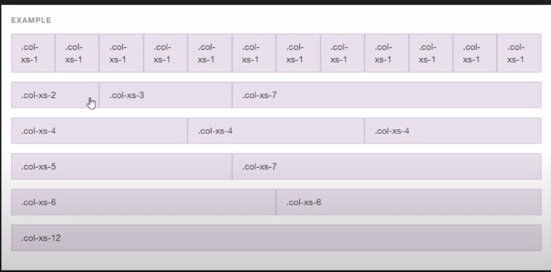
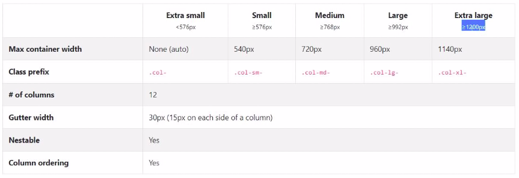
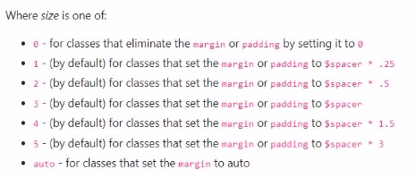

# Grid
- Has total 12 columns.
- must be inside class='row'
  
- Width - To apply different setting in different size screens.
    - if md is used, all classes above with screen greater than md will have same grid format (unless specified).
  

# Classes
### Containers
- container - Center
- container-fluid - Uses full-screen

### Padding-Spacing
Inside utilities -> spacing
- mt-2 - Margin top.
- pt-4 - Padding top.
- mb-4 - Margin bottom
- my-3 - Margin top and bottom
- py-4 - Padding top and bottom
- mx-auto - center in x-axis

- justify-content-between

- float-left
- float-right
  

### Images
- img-thumbnail

### Forms
- form-control

### Buttons
- success, danger, info, primary
- outline

# Components
- Carousal - Slide show of images.
- Cards
- Table
- footer
    - fixed-bottom
- jumbotron
- Button group
- Modal - Cool alert box.